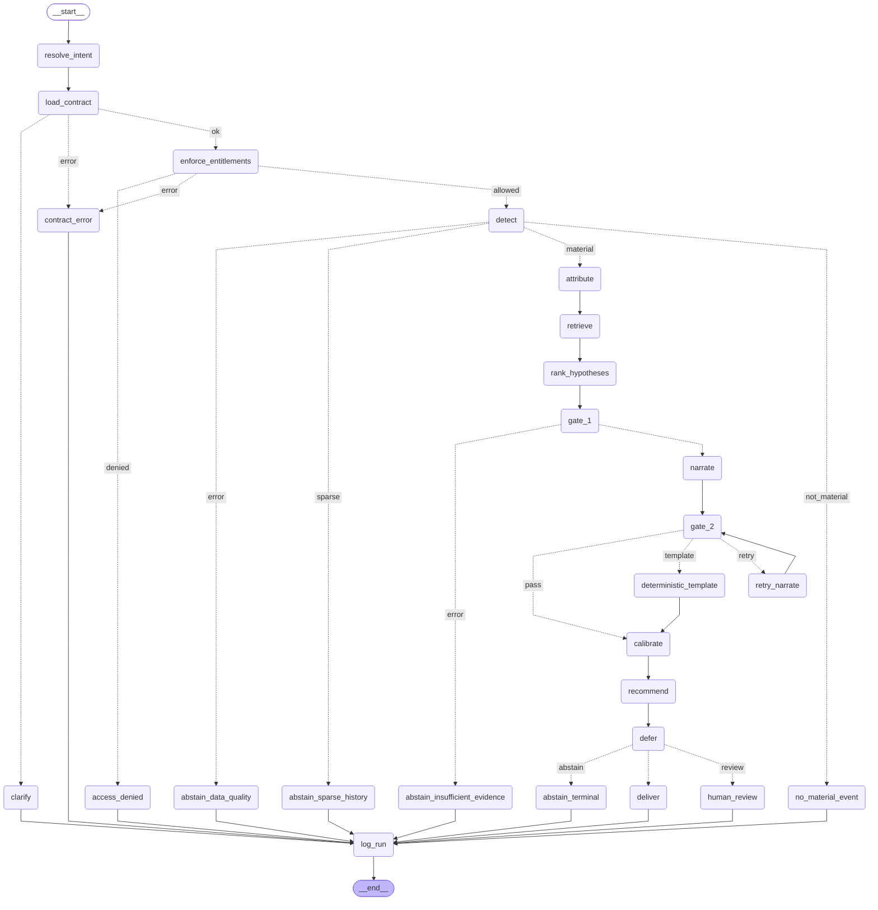

# Stage 10 — LangGraph orchestration

> **SYNTHETIC_EVALUATION.** Scenario outcomes, routing and orchestration timings measured on the generated dataset — seed `20260821`, 535 days, 6 injected events (`python -m data.generate`). The events were injected by this repository, so their ground truth is known by construction rather than labelled by a human. These figures characterise the method on this dataset; they are **not** production accuracy and do not predict performance on real business data.
>
> Runtimes are wall-clock on one developer machine, single process, warm caches. They characterise where time goes, not what the system would cost under concurrency.

Generated by `python -m eval.run_graph_eval`. Scenarios are imported from the Stage 9 harness (ADR-028), not restated.

## Scenario outcomes

| Scenario | Role | Terminal | Confidence | Lever | Deferral | Scope | Withheld | Nodes | Wall ms |
|---|---|---|---|---|---|---|---|---|---|
| S1 | analytics_lead | `VERIFIED_TEMPLATE` | HIGH (0.97) | L_GATEWAY_ESCALATE | **automate** | raise_request | — | 16 | 49,354 |
| S2 | analytics_lead | `REVIEW_REQUIRED` | UNCALIBRATED (0.95) | L_MONITOR_ONLY | **review** | none | — | 14 | 14,414 |
| S3 | analytics_lead | `REVIEW_REQUIRED` | UNCALIBRATED (0.56) | L_MONITOR_ONLY | **review** | none | — | 14 | 13,685 |
| S4 | analytics_lead | `ABSTAIN_SPARSE_HISTORY` | — (0.00) | — | **—** | — | — | 6 | 46 |
| S5a | ops_lead | `VERIFIED_TEMPLATE` | HIGH (0.95) | L_GATEWAY_ESCALATE | **automate** | raise_request | 1 | 16 | 4,380 |
| S5b | finance_director | `VERIFIED_TEMPLATE` | HIGH (0.97) | L_GATEWAY_ESCALATE | **automate** | raise_request | — | 16 | 14,602 |
| S6 | ops_lead | `VERIFIED_TEMPLATE` | HIGH (0.95) | L_GATEWAY_ESCALATE | **automate** | raise_request | 1 | 16 | 4,507 |
| S7 | analytics_lead | `NO_MATERIAL_EVENT` | — (0.00) | — | **—** | — | — | 6 | 301 |

## Graph path taken

- **S1**: resolve_intent -> load_contract -> enforce_entitlements -> detect -> attribute -> retrieve -> rank_hypotheses -> gate_1 -> narrate -> gate_2 -> deterministic_template -> calibrate -> recommend -> defer -> deliver -> log_run
- **S2**: resolve_intent -> load_contract -> enforce_entitlements -> detect -> attribute -> retrieve -> rank_hypotheses -> gate_1 -> narrate -> gate_2 -> deterministic_template -> calibrate -> recommend -> defer
- **S3**: resolve_intent -> load_contract -> enforce_entitlements -> detect -> attribute -> retrieve -> rank_hypotheses -> gate_1 -> narrate -> gate_2 -> deterministic_template -> calibrate -> recommend -> defer
- **S4**: resolve_intent -> load_contract -> enforce_entitlements -> detect -> abstain_sparse_history -> log_run
- **S5a**: resolve_intent -> load_contract -> enforce_entitlements -> detect -> attribute -> retrieve -> rank_hypotheses -> gate_1 -> narrate -> gate_2 -> deterministic_template -> calibrate -> recommend -> defer -> deliver -> log_run
- **S5b**: resolve_intent -> load_contract -> enforce_entitlements -> detect -> attribute -> retrieve -> rank_hypotheses -> gate_1 -> narrate -> gate_2 -> deterministic_template -> calibrate -> recommend -> defer -> deliver -> log_run
- **S6**: resolve_intent -> load_contract -> enforce_entitlements -> detect -> attribute -> retrieve -> rank_hypotheses -> gate_1 -> narrate -> gate_2 -> deterministic_template -> calibrate -> recommend -> defer -> deliver -> log_run
- **S7**: resolve_intent -> load_contract -> enforce_entitlements -> detect -> no_material_event -> log_run

## Orchestration changed nothing

Each scenario was run twice: once by calling the modules directly (the Stage 9 path) and once through the graph. Confidence band, lever, deferral outcome and automation scope are compared.

**8 of 8 agree.**

## Performance

`overhead` is wall-clock minus the summed node latencies: what the runtime itself cost, measured rather than assumed.

Read the **absolute** column, not the percentage. Orchestration costs a near-constant 15-50 ms per run regardless of scenario, because it is the same fixed number of state merges and checkpoint writes either way. The percentage is therefore high exactly where the run is cheapest - S4 abstains in 54 ms total, so a 16 ms constant is 29% of it - and low where real work happens. Neither figure says the runtime is expensive; the absolute one says what it costs.

| Scenario | Wall ms | Nodes ms | Overhead ms | Overhead % | LLM calls | Slowest nodes |
|---|---|---|---|---|---|---|
| S1 | 49,354 | 49,315 | 38.9 | 0.08% | 0 | retrieve 35,358ms, attribute 13,360ms, detect 446ms, rank_hypotheses 77ms |
| S2 | 14,414 | 14,383 | 31.8 | 0.22% | 0 | attribute 13,756ms, detect 401ms, retrieve 205ms, rank_hypotheses 10ms |
| S3 | 13,685 | 13,654 | 31.8 | 0.23% | 0 | attribute 13,153ms, detect 277ms, retrieve 203ms, enforce_entitlements 8ms |
| S4 | 46 | 34 | 12.7 | 27.37% | 0 | detect 24ms, enforce_entitlements 7ms, resolve_intent 3ms, load_contract 0ms |
| S5a | 4,380 | 4,346 | 34.3 | 0.78% | 0 | attribute 3,744ms, detect 400ms, retrieve 187ms, rank_hypotheses 9ms |
| S5b | 14,602 | 14,563 | 39.7 | 0.27% | 0 | attribute 13,888ms, detect 420ms, retrieve 233ms, rank_hypotheses 10ms |
| S6 | 4,507 | 4,472 | 34.6 | 0.77% | 0 | attribute 3,849ms, detect 410ms, retrieve 193ms, rank_hypotheses 8ms |
| S7 | 301 | 285 | 16.4 | 5.44% | 0 | detect 274ms, enforce_entitlements 8ms, resolve_intent 3ms, load_contract 0ms |

## Terminal states reached

| Terminal | Scenarios |
|---|---|
| `NO_MATERIAL_EVENT` | S7 |
| `ACCESS_DENIED` | — (see note) |
| `ABSTAIN_SPARSE_HISTORY` | S4 |
| `ABSTAIN_INSUFFICIENT_EVIDENCE` | — (see note) |
| `ABSTAIN_CONFLICTING_EVIDENCE` | — (see note) |
| `ABSTAIN_DATA_QUALITY` | — (see note) |
| `CLARIFY_REQUESTED` | — (see note) |
| `VERIFIED_LLM` | — (see note) |
| `VERIFIED_TEMPLATE` | S1, S5a, S5b, S6 |
| `REVIEW_REQUIRED` | S2, S3 |
| `CONTRACT_ERROR` | — (see note) |

The eight demo scenarios do not reach every terminal, and that is expected: they are business scenarios, not fault cases. The unreached ones are covered by `tests/test_graph_failures.py`, which *causes* each fault rather than asserting the handler exists — `ACCESS_DENIED` by denying entitlement, `CLARIFY_REQUESTED` by asking for a KPI that does not exist, `CONTRACT_ERROR` by breaking the contract loader, and the abstention terminals through the deferral engine's typed reasons.

**`VERIFIED_LLM` is unreached for a different reason.** There is no `ANTHROPIC_API_KEY` in this environment, so no run in this report called a model: every narrative here is the deterministic template, and `llm_calls` is 0 in every row. The LLM path is exercised in the tests with fake clients, which prove the retry cap and the Gate 2 fallback, but no live generation has been measured. Stating that is more useful than a number that was never observed.

## Lineage

| Scenario | Records | Bundle hash |
|---|---|---|
| S1 | 15 | `f18a88aa1bce2aa6` |
| S2 | 14 | `7e1c7b76b9a33c53` |
| S3 | 14 | `5b2109b6e1be6886` |
| S4 | 6 | `—` |
| S5a | 15 | `5865b75bfea8f9d6` |
| S5b | 15 | `d8bbd8ee7ee42109` |
| S6 | 15 | `16d88023740dbf63` |
| S7 | 6 | `—` |

## The graph

Generated with `graph.get_graph().draw_mermaid()` — the picture cannot drift from the code.

